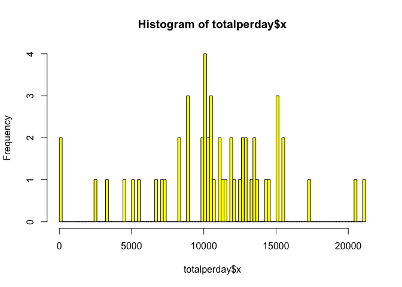
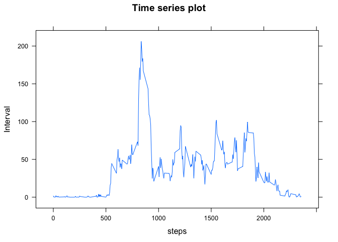
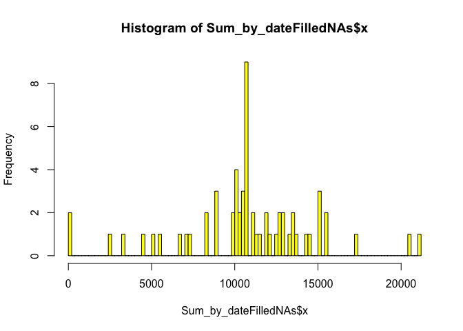
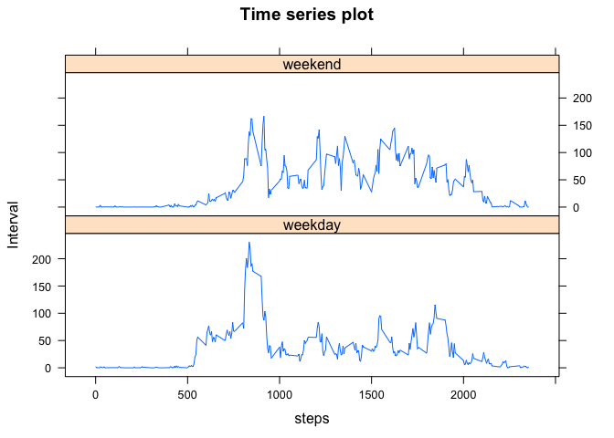

# Reproducible Research: Peer Assessment 1

##Loading and preprocessing data


```r
library(ggplot2)
library(lattice)
mydata <- read.csv(file="activity.csv", header=TRUE, sep=",")
```

## What is the mean total number of steps taken per day?
### Findings: Number of steps taken there is not much difference between the mean and the median. 

```r
##Calculate the mean/median total number of steps taken per day?
totalperday <- aggregate(mydata$steps, list(Date=mydata$date), FUN=sum)
hist(totalperday$x, col = "yellow", breaks = 100)
```

 

```r
## steps to remove all the NA's from the data
mydata_removedNAs <- mydata[which(!is.na(mydata$steps)),]

print(paste("Mean Total number of steps taken per day:", as.character(as.integer(mean(totalperday$x, na.rm=TRUE)))))
```

```
## [1] "Mean Total number of steps taken per day: 10766"
```

```r
print(paste("Median Total number of steps taken per day:", as.character(as.integer(median(totalperday$x, na.rm=TRUE)))))
```

```
## [1] "Median Total number of steps taken per day: 10765"
```

```r
## Mean steps taken per day = 10766, Median steps taken per day = 10765
```

##What is the average daily activity pattern?
### Findings: The morning rush hour seems to be time Interval when this sample population is most active  or there are maximum steps taken.

```r
##Make a time series plot (i.e. type = "l") of the 5-minute interval (x-axis) and the 
##average number of steps taken, averaged across all days (y-axis)
Mean_By_Interval <- aggregate(mydata$steps, list(Interval = mydata$interval), na.rm = TRUE, FUN=mean)
xyplot (Mean_By_Interval$x~Mean_By_Interval$Interval,type="l",xlab="steps", ylab = "Interval", main="Time series plot")
```

 

```r
##Which 5-minute interval, on average across all the days in the dataset, contains the 
##maximum number of steps?
MaxNumofStepsbyInterval <- Mean_By_Interval$Interval[which(Mean_By_Interval$x == max(Mean_By_Interval$x))]
print(MaxNumofStepsbyInterval)
```

```
## [1] 835
```

```r
##Answer = 206.1698
MaxNumofStepsbySteps <- Mean_By_Interval$x[which(Mean_By_Interval$x == max(Mean_By_Interval$x))]
print(MaxNumofStepsbySteps)
```

```
## [1] 206.2
```

```r
#Answer = 835
```

## Imputing missing values
## Calculate and report the total number of missing values in the dataset (i.e. the total number of rows with NAs)
### Findings: Once NAs are filled (strategy: average for each interval across all days is used to fill in any NA for a particular day/interval), the mean and median remain the same, frequency of high total number of steps per day increases (which is obvious since now instead of NAs there are actual values)

```r
print(paste("number of NA rows = ", sum(is.na(mydata$steps))));
```

```
## [1] "number of NA rows =  2304"
```

```r
#Answer =  gives a value of 2304

## Create a new data set that is equal to the original dataset 
## but with the missing data filled in.
mydata$stepsFilledNAs <- mydata$steps;
for(i in 1:nrow(mydata)){
        if(is.na(mydata$steps[i])){        
        
                replace <- Mean_By_Interval$x[which(Mean_By_Interval$Interval==mydata$interval[i])]
                mydata$stepsFilledNAs[i] <- replace
        }
}

##Make a histogram of the total number of steps taken each day and 

Sum_by_dateFilledNAs <- aggregate(mydata$stepsFilledNAs, list(Date=mydata$date), sum);
hist(Sum_by_dateFilledNAs$x, col= "yellow", breaks=100);
```

 

```r
##Calculate and report the mean and median total number of steps taken per day.
Mean_By_DateFilledNAs <- aggregate(mydata$stepsFilledNAs, list(Date = mydata$date), mean);
Median_By_DateFilledNAs <- aggregate(mydata$stepsFilledNAs, list(Date = mydata$date),na.rm = TRUE, FUN= median);

##Do these values differ from the estimates from the first part of the assignment? 
##What is the impact of imputing missing data on the estimates of the total daily number of steps?

print(paste("With Filled NAs Mean Total number of steps taken per day:", as.character(as.integer(mean(Sum_by_dateFilledNAs$x)))))
```

```
## [1] "With Filled NAs Mean Total number of steps taken per day: 10766"
```

```r
print(paste("With Filled NAs Median Total number of steps taken per day:", as.character(as.integer(median(Sum_by_dateFilledNAs$x)))))
```

```
## [1] "With Filled NAs Median Total number of steps taken per day: 10766"
```

```r
## Mean steps taken per day = 10766, Median steps taken per day = 10766

hist(totalperday$x, col = "yellow", breaks = 100)
```

 

```r
hist(Sum_by_dateFilledNAs$x, col= "red", breaks=100)
```

 

```r
xyplot (Mean_By_Interval$x~Mean_By_Interval$Interval,type="l",xlab="steps", ylab = "Interval", main="Time series plot")
```

 

## Are there differences in activity patterns between weekdays and weekends?

##For this part the weekdays() function may be of some help here. Use the dataset with the filled-in missing values for this part.

##Create a new factor variable in the dataset with two levels – “weekday” and “weekend” indicating whether a given date is a 
##weekday or weekend day.
###Findings: On weekdays there is more activities during morning rush hours where as on the weekends there is more activity throughout the day eg:kids sports games/practices, family/friends dinners, errands, etc...

```r
mydata$weekday <-mydata$date
mydata$weekday <- weekdays(as.Date(as.character(mydata$weekday)))
for(i in 1:nrow(mydata)){
        if (mydata$weekday[i]=="Saturday" | mydata$weekday[i]=="Sunday") {
                mydata$weekday[i] <- "weekend"       
        }else {
                mydata$weekday[i] <- "weekday"
        }
        
}
mydata$weekday <- as.factor(mydata$weekday)

##Make a panel plot containing a time series plot (i.e. type = "l") of the 5-minute interval (x-axis) and the average number of steps 
##taken, averaged across all weekday days or weekend days (y-axis). The plot should look something like the following, which was 
##creating using simulated data:

Mean_By_IntervalFilledNas <- aggregate(mydata$stepsFilledNAs, list(Interval = mydata$interval,weekday=mydata$weekday), FUN=mean)
xyplot (Mean_By_IntervalFilledNas$x~Mean_By_IntervalFilledNas$Interval | Mean_By_IntervalFilledNas$weekday, layout = c(1,2) ,type="l",xlab="steps", ylab = "Interval", main="Time series plot")
```

 
